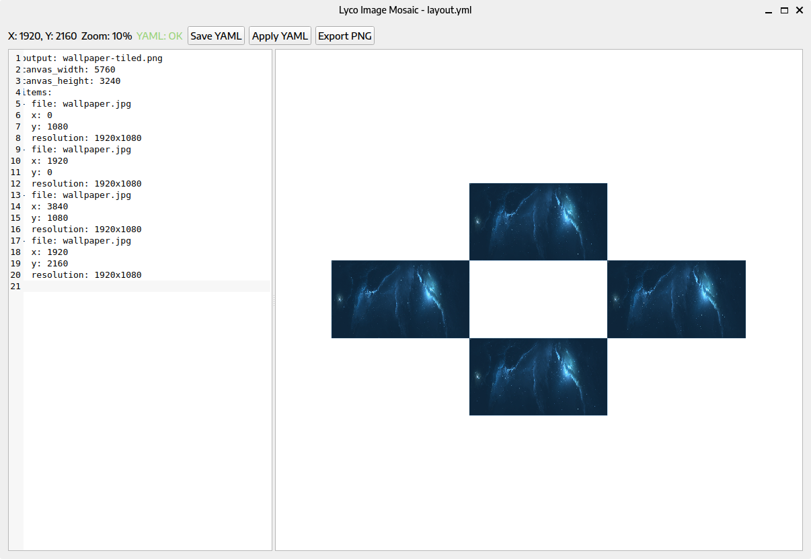

# Lyco Python Framework

Lyco Python Framework is a boilerplate for building Python desktop tools. It provides a runnable example app (image mosaic) plus a full stack of tooling: CI, security scans, task runner, docs, and AI-assisted maintenance prompts.

**What you get**
- A working CLI + PyQt GUI example app under `src/lyco/`.
- Packaging and entry points for `lyco`, module runs, and repo wrapper.
- CI/CD workflows for GitHub and GitLab.
- Security tooling (bandit, pip-audit, safety, SBOM, secrets scan).
- A task runner and Makefile targets for consistent local and CI commands.
- AI-assistance files to keep project context, prompts, and roadmap aligned.



## Quick Start
1. Generate `.env` defaults: `python tools/setup_env.py`.
2. Install runtime deps: `python -m pip install -r requirements.txt`.
3. Run the example app: `python Lyco.py --help`.
4. Run tests: `python -m unittest discover -s tests`.

## Use As Boilerplate
1. Update `pyproject.toml` (name, description, scripts, dependencies).
2. Replace the example app under `src/lyco/` with your own package.
3. Update `src/lyco/app_config.json` to point at your module/callable.
4. Update `README.md`, `DOCS.md`, `CONTEXT.md`, and `AGENT.md`.
5. Keep the tooling, CI, and security scaffolding as your foundation.

See `docs/boilerplate.md` and `docs/ai-assistance-customization.md` for the guided workflow.

## Example App (Image Mosaic)
The bundled Hello-world app composes a transparent wallpaper from a YAML layout file and includes a PyQt GUI editor.

Example YAML:

```yaml
output: wallpaper.png
canvas_width: 7680
canvas_height: 2160
items:
  - file: "img1.png"
    x: 0
    y: 0
    resolution: "1920x1080"
  - file: "img2.jpg"
    x: 1920
    y: 0
    resolution: "2560x1440"
```

## CLI Usage

```powershell
lyco compose -c layout.yml -o wallpaper.png
lyco gui -c layout.yml
```

Repo wrapper (no install):

```powershell
python Lyco.py compose -c layout.yml -o wallpaper.png
python Lyco.py gui -c layout.yml
```

Module invocation:

```powershell
python -m lyco --help
```

## Install
Target Python version: 3.12 (see `.python-version`).

```powershell
python -m pip install -r requirements.txt
python -m pip install -r requirements-dev.txt
```

Editable install:

```powershell
python -m pip install -e .
```

Optional semgrep tools:

```powershell
python -m pip install -r requirements-semgrep.txt
```

## Tooling And AI Assistance
- Task runner: `python tools/run_task.py ci-fast` and `python tools/run_task.py ci-full`.
- Tooling flags and cache behavior: `TOOLING.md`.
- AI-assistance files: `AGENT.md`, `CONTEXT.md`, `STATE.json`, `TASKS.md`, `TODO.md`.
- CI/CD prompts: `prompts/CI_CD_TASKS.md` and `prompts/`.
- Guides: `docs/` (see `docs/README.md`).

## Tests

```powershell
python -m unittest discover -s tests
```

CI is configured for GitHub Actions and GitLab CI (`.github/workflows/ci.yml`, `.gitlab-ci.yml`).

## Build Notes

```powershell
python -m pip install .[build]
python tools/build_binary.py
python -m build
```

Nuitka does not support the Windows Store Python distribution. Use Python from python.org for binary builds on Windows.

## Docs
- Full usage and installation details: `DOCS.md`.
- Boilerplate and AI-assistance guides: `docs/`.

## License
GNU General Public License v3.0. See `LICENSE`.